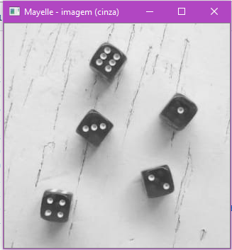
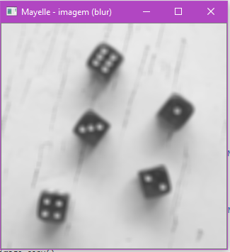
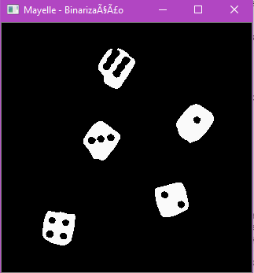
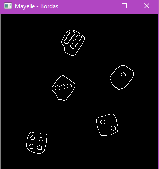
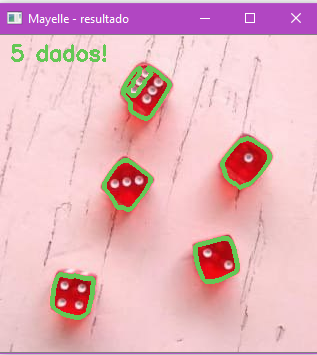

#Atividade de Multimidia com Visão Computacional

## 1ª Questão

Imagem Original:

Tons de Cinza:

Filtro Blur:

Efeito Binarização:

Idenficação de bordas:

Resultado

## 2 Questão

Local: Ambientes de avaliações por gabarito (Escolas e ou instituições)

A utiliização da visão computacional pode melhorar no processo de avaliãções e simulados escolares para economizar em tempo na execução do processo de correção, que quando realizado de forma manual tende a ser demorado, e na validação das respostas, em questões de que a correção de  provas, simulados e seletivos tendem a muitos erros humanos. A visão computacional poderia ajudar na automação deste processo de correção de provas que possuem padrrões de gabaritos.

